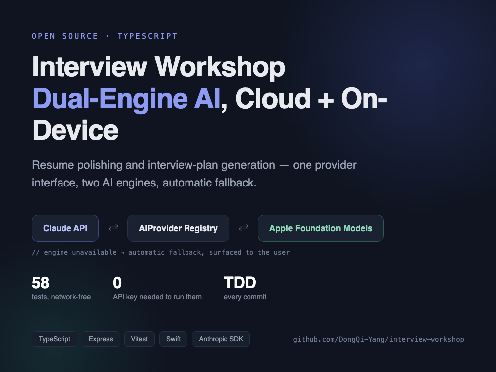

# 面试工坊



本地运行的面试准备小工具：粘贴简历即可获得**逐条润色建议 + 改写全文**，粘贴简历与目标岗位 JD 即可生成**面试备战方案**（重点 / 预测题 / 冲刺日程）。生成的面试方案还能一键转成**练习打卡计划**——按天勾选完成情况、进度实时可见、随时可覆盖式重新生成。AI 能力走**端云双引擎**——云端 Claude API 与 macOS 端侧 Foundation Models 二选一，活跃引擎不可用时自动降级到另一个，且在结果里如实标注「本次使用了哪个引擎、是否发生了降级」。

<!-- 截图位：首页「简历润色」Tab，粘贴简历 → 展示建议列表 + 改写全文 -->
<!-- 截图位：「面试方案」Tab，展示备战重点 / 分类预测题 / 按天冲刺计划 -->
<!-- 截图位：「练习打卡」Tab，展示任务勾选状态与进度（x / y） -->
<!-- 截图位：顶部引擎切换下拉框，展示某引擎不可用时的禁用态与原因提示 -->

定位：求职作品集 + 自用工具。全部代码分层清晰、有单元测试覆盖，本文档同时充当设计决策讲解材料。

---

## 一、快速开始

```bash
# 1. 安装依赖（全部落在项目 node_modules/，无任何全局安装）
npm i

# 2. 配置云端凭证（二选一，用于 Claude Provider；缺省时会在设置里显示为不可用并降级到端侧）
export ANTHROPIC_API_KEY=sk-ant-xxx
# 或：ant auth login   # 走本地 profile（~/.config/anthropic），无需在此设置环境变量

# 3.（可选）编译端侧 Foundation Models 桥接 CLI —— 仅 macOS 26 + 已开启 Apple Intelligence 的机器需要
sh bridge/build.sh   # 产物：bridge/bin/fm-bridge（已被 .gitignore 排除，不入库）

# 4. 启动
npm run dev           # tsx src/server.ts，默认监听 http://localhost:5173
```

两个引擎都可以缺失：都不可用时，涉及 AI 调用的接口会返回 `502 ProviderError`，前端会把失败原因展示出来，不会崩溃或白屏。

---

## 二、架构

### 2.1 分层

```
public/            单页前端（原生 HTML/CSS/JS，无构建步骤，无框架依赖）
  ├─ index.html       四个 Tab：简历润色 / 面试方案 / 练习打卡 / 历史记录
  ├─ app.js           fetch 调用 /api/v1/*，渲染结果，展示引擎与降级信息、异常原因
  └─ style.css

src/
  ├─ server.ts         组装依赖（Provider 列表 / Store）并启动 HTTP 服务（唯一「知道具体实现」的地方）
  ├─ app.ts             createApp(deps)：路由 + 统一 zod 校验 + 统一错误边界，依赖以参数注入
  ├─ config.ts          AppConfig（activeProvider / claudeModel）与默认值
  ├─ errors.ts          ValidationError（从 app.ts 抽出到独立文件，services 层也需要抛输入错误，不能反向依赖 HTTP 层）
  ├─ ai/
  │   ├─ provider.ts     AIProvider 接口 + ProviderError（业务只依赖这个接口）
  │   ├─ registry.ts     ProviderRegistry：读取活跃 Provider、执行降级链
  │   ├─ claudeProvider.ts   云端实现（@anthropic-ai/sdk）
  │   ├─ appleFMProvider.ts  端侧实现（spawn bridge/bin/fm-bridge，stdin/stdout JSON）
  │   ├─ mockProvider.ts     测试用实现，不参与自动降级
  │   └─ json.ts             completeJson：把「模型输出裸文本」转成「zod 校验过的结构化 JSON」，失败自动重试一次
  ├─ services/
  │   ├─ resumeService.ts    简历润色的 prompt + 结果 schema
  │   ├─ planService.ts      面试方案的 prompt + 结果 schema
  │   ├─ practiceService.ts  练习打卡的纯函数：buildPracticePlan（从方案记录生成按天任务）/ toggleTask（勾选与取消）
  │   └─ records.ts          AppRecord 类型定义（历史记录条目）
  └─ store/
      └─ jsonStore.ts        Store<T> 接口 + 基于本地 JSON 文件的实现（原子写、损坏自动回退、update() 按实例串行化的读改写）

bridge/
  ├─ fm-bridge.swift    端侧桥源码：stdin 读 JSON（system/prompt）→ 调 FoundationModels → stdout 输出文本；--check 只探测可用性
  └─ build.sh           xcrun swiftc 编译，产物落 bridge/bin/（不入库）

test/                  Vitest + supertest，14 个文件 57 个用例，全部使用 MockProvider / 假桥接脚本，零网络依赖
```

### 2.2 Provider 降级链

```
请求进来
   │
   ▼
ProviderRegistry.complete(req)
   │
   ├─ 读取 config.json 中的 activeProvider
   ├─ 排出尝试顺序：[活跃 Provider, 其余「真实」Provider...]（mock 不参与自动降级，只能被显式选中，见铁律 3）
   │
   ▼
依次尝试每个 Provider：
   ├─ checkAvailability() 为 false → 记录原因，跳到下一个
   ├─ complete() 抛错（凭证无效/限流/网络/端侧桥崩溃/超时）→ 记录，跳到下一个
   └─ 成功 → 返回 { text, providerId, fallback: providerId !== 活跃Provider.id }
   │
   ▼
全部失败 → 抛 ProviderError，HTTP 层统一映射为 502
```

`fallback` 与实际生效的 `providerId` 会透传到 `polishResume` / `generatePlan` 的返回值，再到前端逐条渲染成「本次使用：xxx（活跃引擎不可用，已自动降级）」——降级对用户可见，不是静默行为。

### 2.3 关键设计决策

- **为什么用接口抽象 `AIProvider`**：`services/` 与 `ai/registry.ts` 只依赖 `checkAvailability()/complete()` 两个方法，不知道具体是 Claude SDK 还是 spawn 出的 Swift 进程。新增第三个引擎（例如未来接 OpenAI）只需新增一个实现类并在 `server.ts` 注册，不改 `registry.ts`/`services/` 任何一行（对应铁律 6：扩展性）。同时业务层测试可以 100% 用 `MockProvider` 替身，不碰真实网络（对应验证纪律：零网络依赖）。

- **为什么原子写（临时文件 + rename）**：`jsonStore.ts` 写入时先写到同目录下的 `.{uuid}.tmp`，成功后用 `rename` 原子替换目标文件。`rename` 在同一文件系统下是原子操作，进程在写入中途被杀掉或断电，磁盘上永远只存在「写入前的旧文件」或「写入后的新文件」两种状态之一，不会出现半截 JSON（对应铁律 3：极强稳定性，重启零数据丢失）。读取时若解析失败（历史遗留损坏文件），自动改名备份并回退默认值，而不是让整个进程崩溃。

- **为什么 `Store.update(fn)` 要按实例串行化**：`recordsStore`（润色/方案两条路由都会 `unshift` 写入历史）与 `practiceStore`（打卡勾选）都可能被并发请求同时读改写——先 `read()` 再 `write()` 拆成两步会出现「后写覆盖先写」的丢更新竞态。每个 `createJsonStore` 实例在闭包内维护一条独立的 `chain: Promise<unknown>`，每次调用 `update` 把自身接到该实例的链尾，保证同一 store 实例上的多次 `update` 严格排队执行；不同 store 实例（`recordsStore` 与 `practiceStore`）各有各的 `chain`，互不阻塞，仍然并发（对应铁律 3 稳定性 + 铁律 4 并发：排队但不阻塞事件循环）。`fn` 本身抛错只会 reject 调用方拿到的那个 `update()` promise，不会卡死链上后续排队的 `update`（`test/jsonStore.test.ts` 有专门的锁定测试）。

- **为什么 zod 双向校验**：入向（HTTP body）用 `PolishBody`/`PlanBody` 校验长度与必填，拦在路由层，失败统一映射为 `400 ValidationError`——这是用户输入的问题，不该算成 AI 故障；出向（LLM 返回的裸文本）用 `PolishResultSchema`/`InterviewPlanSchema` 校验结构，因为大模型输出格式不受我们控制，校验失败时 `completeJson` 会把错误信息回填进下一轮 prompt 自动重试一次，仍失败才抛 `ProviderError`（对应铁律 5：鲁棒性——外部输入无论来自用户还是模型，都不被信任）。

- **为什么统一 `{ok, data}` / `{ok, error:{code,message}}` 响应包**：前端只需要判断 `body.ok`，不用对每个接口单独写错误分支；错误返回的 `code` 就是异常类名（`ValidationError`/`ProviderError`/其他），`message` 是可展示给用户的原因，完整堆栈只落服务端日志，不回传客户端（对应多系统交互准则：稳定数据边界 + 可观测边界）。

### 2.4 API 一览

全部路由前缀 `/api/v1`，成功统一 `{ok:true, data}`，失败统一 `{ok:false, error:{code,message}}`（`code` 见 `err.name`：`ValidationError` → 400，`ProviderError` → 502，其余 500）。

| 方法 & 路径 | 说明 | 请求体 | 成功 `data` |
|---|---|---|---|
| `GET /api/v1/health` | 健康检查 | — | `{status:"up"}` |
| `GET /api/v1/settings/providers` | 引擎列表与可用性 | — | `{active, providers:[{id,name,available,reason}]}` |
| `PUT /api/v1/settings/provider` | 切换活跃引擎 | `{id}` | `{active}` |
| `POST /api/v1/resume/polish` | 简历润色，同步写入历史记录 | `{resumeText}`（1~50000 字） | `{suggestions[], revised, providerId, fallback}` |
| `POST /api/v1/interview-plan` | 生成面试方案，同步写入历史记录 | `{resumeText, jobDescription}`（各 1~50000 字） | `{focusAreas[], questions[], studyPlan[], providerId, fallback}` |
| `GET /api/v1/records` | 历史记录（润色 + 方案） | — | `AppRecord[]` |
| `POST /api/v1/practice-plan`**（Plan 2 新增）** | 从最近一次（或指定 `recordId` 的）面试方案记录生成打卡计划，**覆盖**当前活跃计划；没有任何方案记录时返回中文引导 | `{recordId?}` | `PracticePlan`（`{id, createdAt, sourceRecordId, tasks:[{day,task,done,completedAt}]}`，按 `day` 升序） |
| `GET /api/v1/practice-plan`**（Plan 2 新增）** | 读取当前活跃的打卡计划 | — | `PracticePlan \| null` |
| `PUT /api/v1/practice-plan/tasks/:index`**（Plan 2 新增）** | 勾选 / 取消第 `index` 个任务，写入或清空 `completedAt`；`index` 越界或非整数、`done` 非布尔均 400 | `{done: boolean}` | 更新后的 `PracticePlan` |

---

## 三、铁律对照表

### 3.1 架构铁律（六条）

| 铁律 | 本仓库的落点文件 |
|---|---|
| 1 高内聚 | `src/store/jsonStore.ts`（只管持久化）/ `src/ai/*Provider.ts`（只管模型调用）/ `src/services/*.ts`（只管业务 prompt 与结果 schema）/ `src/app.ts`（只管 HTTP 路由与边界） |
| 2 低耦合 | `src/ai/provider.ts` 的 `AIProvider` 接口 + `src/store/jsonStore.ts` 的 `Store<T>` 接口；`src/app.ts` 的 `createApp(deps: AppDeps)` 依赖注入，无隐式全局状态；`test/helpers.ts` 的 `makeTestDeps()` 用 Mock 注入验证了这一点 |
| 3 极强稳定性 | `src/ai/registry.ts`（Provider 失败自动降级链，全部失败才抛错）/ `src/store/jsonStore.ts`（原子写 + 损坏自动备份回退）/ `src/app.ts` 底部统一错误中间件（任何异常都不会让进程崩溃，只返回对应状态码） |
| 4 极高并发 | `src/store/jsonStore.ts` 使用 `node:fs/promises`；`src/ai/*Provider.ts` 全链路 `async/await`，无同步阻塞 IO |
| 5 极强鲁棒性 | `src/app.ts` 中 `PolishBody`/`PlanBody`（zod 入参校验，含长度上限与必填）/ `src/ai/json.ts` 的 `completeJson`（LLM 输出 zod 校验 + 一次自动重试）/ `test/settingsRoute.test.ts`（未知或缺失 provider id → 400 的专门测试） |
| 6 极强扩展性 | 新增 Provider：新增 `src/ai/xxxProvider.ts` 并在 `src/server.ts` 注册一行，不改 `registry.ts`；Plan 2（练习打卡）实际落地为新增 `src/services/practiceService.ts` + 3 条路由 + 前端一个 Tab，未改动 Plan 1 任何已交付模块内部实现（`Store<T>` 只新增 `update` 方法，`read`/`write` 语义不变）——验证了本条设计；Plan 3（模拟面试对话）留待后续，按同样增量模式接入 |

### 3.2 多系统交互准则（五条）

| 准则 | 本仓库的落点文件 |
|---|---|
| 稳定数据边界 | `src/app.ts` 所有路由前缀 `/api/v1`；响应统一 `{ok, data}` / `{ok, error:{code,message}}` |
| 标准化接口 | 前后端只通过 `public/app.js` 的 `fetch()` 走 HTTP JSON；Node 与 Swift 桥只通过 `src/ai/appleFMProvider.ts` 的 `spawn` + stdin/stdout JSON 通信（`bridge/fm-bridge.swift`） |
| 单一数据源 | `data/` 目录（`config.json`/`records.json`/`practice.json`）只由 `src/store/jsonStore.ts` 读写，前端从不直接碰文件，只经 `/api/v1/records`、`/api/v1/settings/*`、`/api/v1/practice-plan*` 只读/受控写 |
| 可观测边界 | `src/ai/registry.ts` 的 `console.info`/`console.warn`（每次 AI 调用输出 provider / 耗时 / 成败 / 是否降级）；`src/app.ts` 错误中间件的 `console.error`（状态码 + 错误名 + 堆栈） |
| 演进不破坏 | `src/services/resumeService.ts`/`planService.ts` 的结果 schema 均用 `.passthrough()`，为 Plan 2/3 新增字段预留空间；`src/services/records.ts` 的 `AppRecord.result` 类型为 `unknown`，不会因为下期新增结果字段而破坏既有记录的读取 |

---

## 四、原话 vs 已交付 Check 表

| 用户原话 | 已交付证据 |
|---|---|
| 「修改 润色 简历」 | `src/services/resumeService.ts`（`polishResume`：逐条建议 + 改写全文）+ `POST /api/v1/resume/polish`（`src/app.ts`）+ `test/resumeService.test.ts` |
| 「形成面试方案 面试计划」 | `src/services/planService.ts`（`generatePlan`：`focusAreas`/`questions`/**`studyPlan` 按天计划**）+ `POST /api/v1/interview-plan`（`src/app.ts`）+ `test/planService.test.ts` |
| 「本地 Web 应用」 | Express 本地服务（`src/server.ts`，默认监听 `localhost:5173`）+ `public/` 原生单页前端，无外部部署依赖 |
| 「两者都要（端云可切换）」 | `src/ai/claudeProvider.ts`（云端）+ `src/ai/appleFMProvider.ts`（端侧）+ `src/ai/registry.ts` 的 `ProviderRegistry`（切换与自动降级）+ `test/registry.test.ts` |
| 「练习计划与打卡」 | **本期已交付（Plan 2）**：`src/services/practiceService.ts`（`buildPracticePlan`：从最近方案记录生成按天任务；`toggleTask`：勾选/取消并记录完成时间）+ `POST/GET /api/v1/practice-plan`、`PUT /api/v1/practice-plan/tasks/:index`（`src/app.ts`）+ 前端「练习打卡」Tab（`public/app.js`）+ `test/practiceService.test.ts`（纯函数）+ `test/practiceRoute.test.ts`（路由，含无方案记录/越界/非布尔/无活跃计划/指定 recordId 不存在共 5 条异常场景） |
| 「模拟面试对话」 | **本期未交付**，见 `docs/superpowers/specs/2026-08-27-interview-prep-app-spec.md` 分期定义（Plan 3）——显式声明为分期排除，非漂移遗漏 |

**已知偏差（相对最初讨论的如实说明）**：

1. 设置接口 `PUT /api/v1/settings/provider` 在请求体缺失 `id` 或 `id` 未知时返回 `400`（`ValidationError`），而不是把它当成 Provider 自身故障（`502 ProviderError`）——这是客户端输入问题，不是上游 AI 故障，两者语义不同，见 `test/settingsRoute.test.ts`。
2. 前端（`public/app.js`）对引擎列表加载失败、切换引擎失败、润色/生成方案失败、历史记录加载失败均有独立的 `catch` 分支，把失败原因（`err.message`）直接展示给用户，而不是静默失败或卡在 loading 态，见 `test/frontend.test.ts`。
3. **（Plan 2）** 打卡任务勾选（`checkbox` 的 `onchange`）本应是「PUT 保存 + 刷新列表」一次动作，初版实现把两步包在同一个 `try/catch` 里：PUT 成功后若紧接着的 `GET` 刷新失败，会被误判为整体失败并回滚 checkbox 状态——但服务端其实已经保存成功，回滚会让用户看到与实际数据不符的假象。已拆成两段独立 `try/catch`（`public/app.js`）：PUT 失败才回滚 checkbox 并禁用解除、报错；PUT 成功后仅刷新失败时**不回滚**，只提示「已保存，但刷新失败：...」。锁定测试见 `test/frontend.test.ts`（断言 `/app.js` 响应体含该文案），修复提交为 `91722a9`。

**Plan 2 工程加固（Plan 1 终审移交清单，本期落地部分，见 `docs/superpowers/specs/2026-08-27-plan2-practice-spec.md`）**：

| 加固项 | 落点 |
|---|---|
| Store 并发读改写无保护，records 有丢更新竞态 | `Store<T>` 新增 `update(fn)`，按 store 实例串行化（`src/store/jsonStore.ts`）；polish/plan 路由与新打卡路由全部改用，见 2.3 节说明 |
| `registry.getActive` 失配静默回退无日志、`providers` 空数组无防御 | 空数组构造即抛 `ProviderError`；失配回退时 `console.warn`（`src/ai/registry.ts`） |
| `esc(s.severity)` 漏套转义 | 补上，`public/app.js` |
| `PolishBody`/`PlanBody` 的 `max(50000)` 分支无测试 | 各补一条超长 400 测试（`test/errorBoundary.test.ts`） |
| 润色/生成方案按钮无双击并发守卫 | 请求期间 `disabled=true`，成功/失败路径统一恢复（`public/app.js`，打卡的生成/重生成/勾选按钮同样应用了这个模式） |
| 端侧桥超时击杀后错误文案不可辨识 | `code===null`（被 timeout 强杀）单独文案「端侧桥执行超时被终止」，超时时长可通过构造参数注入以便测试（`src/ai/appleFMProvider.ts`） |
| `package.json` 脚手架残留（`main`/`directories`） | 已清理，`scripts`/依赖未动 |

**仍留后续（本期不做，`docs/superpowers/specs/2026-08-27-plan2-practice-spec.md` 中已显式声明「留 Plan 3 或按需」，非遗漏）**：`data/` 目录相对 `cwd` 的基准未做成绝对路径防御；Swift 端侧桥 `fm-bridge.swift` 未改成 `Task.detached`（留到下次真机验证端侧引擎时再改）；`saveRecord`（`src/app.ts` 中 polish/plan 两条路由里重复的写历史记录片段）未抽取成公共函数（仍只有两处调用，未到抽取阈值）；`maxTokens` 相关注释精简未处理；前端 `genPractice`/`regenPractice`（`public/app.js`）两个按钮的处理逻辑是同型双段代码，未合并（低风险 minor，deferred）。

---

## 五、测试说明

```bash
npm test          # vitest run —— 14 个测试文件，57 个用例
npm run build      # tsc --noEmit —— TypeScript strict 类型检查
```

- 全部测试**零网络依赖**：AI 调用统一走 `test/mockProvider.test.ts` 覆盖的 `MockProvider`（`src/ai/mockProvider.ts`）或 `test/fixtures/fake-bridge.sh`（模拟端侧桥的 stdin/stdout 行为），不需要真实 `ANTHROPIC_API_KEY`，不需要编译 `bridge/bin/fm-bridge`。
- 数据文件读写用 `mkdtemp` 建的临时目录（见 `test/helpers.ts`），不污染仓库内的 `data/` 目录，任意时刻重跑得到相同结论。
- 覆盖范围：`ai/`（每个 Provider 的成功/失败/超时路径）、`ai/registry.ts`（**降级链 4 种场景 + Provider 管理 3 种场景**：活跃 Provider 成功/不可用降级/调用失败降级/全部失败抛错，加上 `setActive` 持久化拒绝未知 id、mock 不参与自动降级、`providers` 空数组构造即抛）、`ai/json.ts`（结构化输出重试）、`services/`（简历润色 / 面试方案两个业务 service 的成功路径与 schema 校验，`practiceService.ts` 打卡计划构建与勾选的纯函数逻辑）、`store/jsonStore.ts`（读写、原子性、损坏回退、`update()` 并发串行化与失败隔离）、`app.ts`（每个路由的成功/校验失败路径，含 3 条打卡路由的 5 种异常场景）、前端静态资源（`test/frontend.test.ts`）。

---

## 六、目录速查

| 路径 | 说明 |
|---|---|
| `src/server.ts` | 启动入口，组装真实依赖 |
| `src/app.ts` | 路由 + 校验 + 错误边界（`createApp(deps)`） |
| `src/ai/` | Provider 接口、三个实现（claude/apple/mock）、注册表、JSON 补全工具 |
| `src/services/` | 三个业务 service（简历润色 / 面试方案 / 练习打卡） |
| `src/errors.ts` | `ValidationError`（services 与 app.ts 共用） |
| `src/store/jsonStore.ts` | 通用 JSON 文件存储（原子写、`update()` 按实例串行化） |
| `public/` | 原生前端（无构建步骤） |
| `bridge/` | 端侧 Swift 桥源码与构建脚本 |
| `test/` | Vitest 单测（含 fixtures 假桥脚本） |
| `docs/superpowers/specs/2026-08-27-interview-prep-app-spec.md` | Plan 1 完整 spec：需求原话、分期、铁律对照原始定义 |
| `docs/superpowers/specs/2026-08-27-plan2-practice-spec.md` | Plan 2 spec：练习计划与打卡的功能需求 + 工程加固清单 |
| `.superpowers/sdd/2026-08-27-plan2-practice/` | Plan 2 开发的 task brief 与各任务交付报告（本目录整体 `.gitignore`，不入库，仅本地开发过程留痕） |

数据目录 `data/`（`config.json`/`records.json`/`practice.json`）与端侧桥编译产物 `bridge/bin/` 均已加入 `.gitignore`，不入库；首次运行会自动创建。
